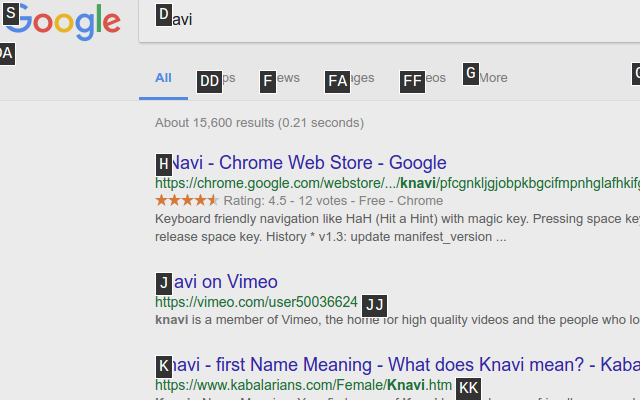
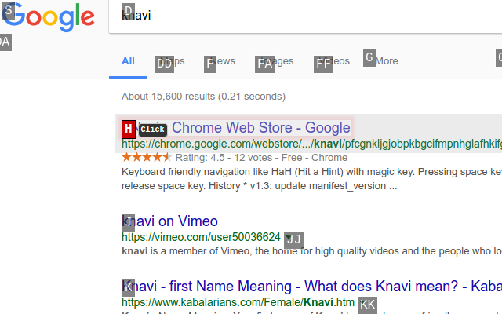

# knavi

A chrome extension which Hit-a-Hint with magic key.

<a target="_blank" href="https://chrome.google.com/webstore/detail/knavi/pfcgnkljgjobpkbgcifmpnhglafhkifg"></a>

## Screen Shot

Hinting:



Hiting:



## Description

This is for clicking links and buttons with keyboard only. Pressing space key and hint key simulates clicking links and buttons.

By releasing space key with modifier keys such as `Ctrl` or `Alt`, you can open links in new tab or new window.

The default magic key is space key, but you can change it in options.

## Build

See [Dockerfile](Dockerfile) for build environment.

Debug build:

```sh
make
```

Interactive debug build:

```sh
make watch
```

zip for production build:

```sh
make zip
```

`docker` makes it easy to build environment:

```sh
docker compose run make
docker compose run make watch
docker compose run make zip
```

## Development note

Edit changelog in `changelog/<CurrentVersion>.md`. It will be used for release note.

## Release

1. Check the version in [package.json](package.json)
2. Confirm `changelog/<Version>.md`
3. Commit and push them
4. Execute `scripts/tag_for_release.sh`
5. Bump minor version in [package.json](package.json) for next release
