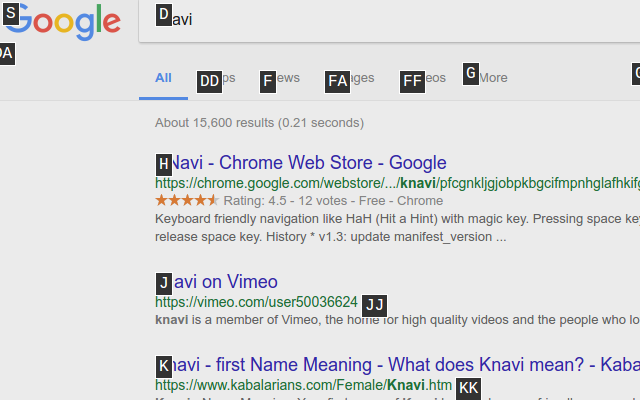
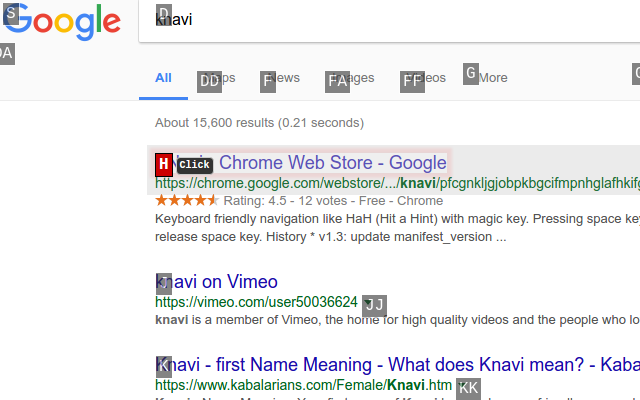

# knavi

A Hit-a-Hint Chrome extension. Hold Space, type a hint key, and release to click links and buttons without a mouse.

<a target="_blank" href="https://chrome.google.com/webstore/detail/knavi/pfcgnkljgjobpkbgcifmpnhglafhkifg"></a>

## Screenshot

Hints displayed:



Hit confirmed:



## Description

Click links and buttons with the keyboard only. Hold the Peek Key (Space by default), type the hint key shown on each target, then release to click. Hold `Ctrl`, `Shift`, or `Alt` on release to open links in a new tab or window.

Prefer not to hold a key down? Bind a Sticky Key in options to show hints with a single press, and an Action Key to click.

The Peek Key, Sticky Key, hint letters, and per-site selectors are all configurable in options.

## Build

Tool versions are managed by [mise](https://mise.jdx.dev/). Run `mise install`
and `npm ci` first to set up the build environment.

Debug build:

```sh
npm run build
```

Interactive debug build:

```sh
npm run watch
```

zip for production build:

```sh
npm run zip
```

## Development note

Edit changelog in `changelog/<CurrentVersion>.md`. It will be used for release note.

## Release

1. Check the version in [package.json](package.json)
2. Confirm `changelog/<Version>.md`
3. Commit and push them
4. Create and push the release tag by either:
   - Running the [tag-for-release workflow](https://github.com/kui/knavi/actions/workflows/tag-for-release.yaml)
     on GitHub Actions ("Run workflow" button, or `gh workflow run tag-for-release.yaml`)
   - Executing `scripts/tag_for_release.bash` locally and pushing the tag
5. Bump minor version in [package.json](package.json) for next release
